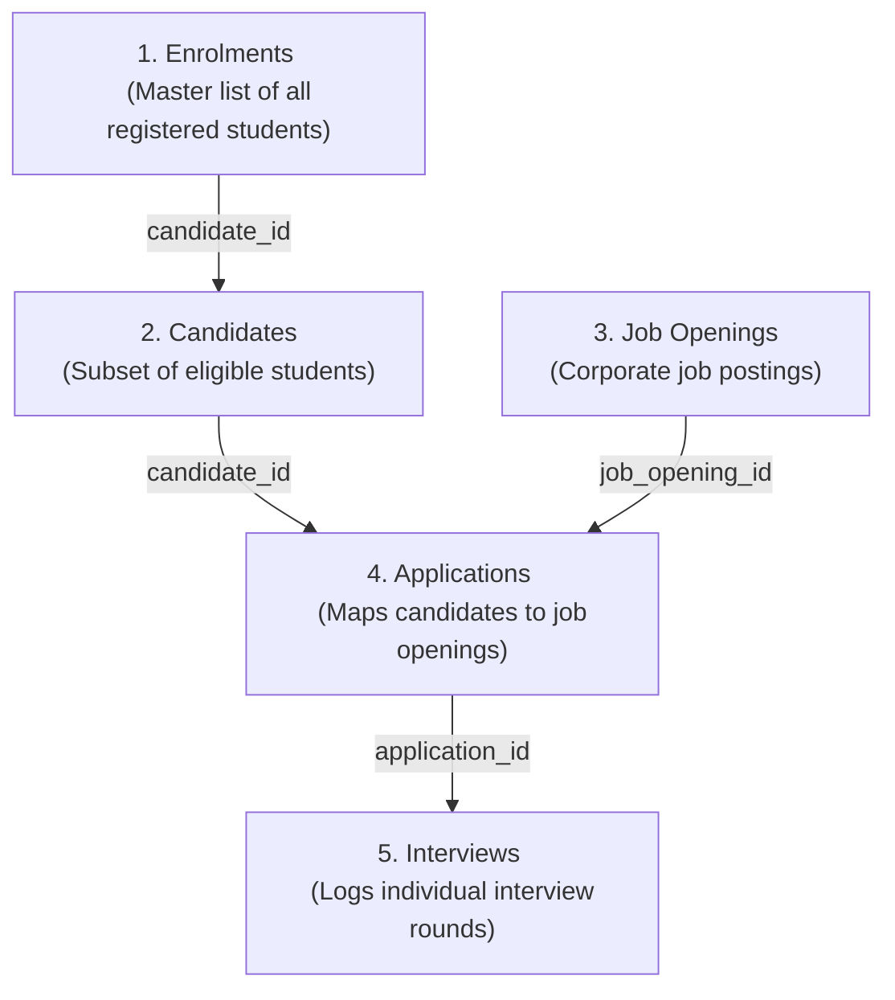

# Campus Placement Analytics & Executive Dashboard

This project is a complete technical and analytical submission for the Placement & Data Analytics skill test. It features a fully normalized relational database, a diagnostic data pipeline, and an interactive executive dashboard with a live SQL Query Sandbox.

---

## Raw Data Inconsistencies (Per-CSV Audit)

> All findings below were verified by running an automated audit directly against the original, unmodified CSV files. The raw files were **never altered** — findings were handled during the database ingestion step only.

---

### 1. Enrolments CSV (113 rows)

| Inconsistency | Count | Details |
|:---|:---|:---|
| **Missing CandidateId** | 75 of 113 rows | 66% of enrolment records have no linked `CandidateId`. These are students not yet moved to the Candidates table — early-stage enrolments only. |
| **Knocked Off with no reason** | 1 row | 1 student has `Stage = 'Knocked Off'` but the `Knocked Off Reason` field is blank — incomplete data entry. |
| **Stage/Reason mismatch** | 0 | All other `Knocked Off Reason` entries correctly correspond to `Stage = 'Knocked Off'`. No false fills. |
| **Duplicate emails** | 0 | Each student enrolled once — no re-enrolments. |

**Distinct Stage values confirmed:** `Hired`, `Initiate Placement`, `Knocked Off`, `Not Eligible for Placement Outreach`, `On Hold`, `Outreach Initiated`

---

### 2. Candidates CSV (38 rows)

| Inconsistency | Count | Details |
|:---|:---|:---|
| **NULL Preferred Job Location** | 13 of 38 (34%) | Over a third of candidates never filled this field. Affects location-based matching. |
| **Duplicate Candidate IDs** | 0 | All IDs are unique. |
| **Duplicate emails** | 0 | All emails are unique. |
| **NULL Skill Set** | 0 | All candidates have skills listed (though stored as a single comma-separated blob — not individual rows). |

> **Note:** `Skill Set` stores all skills as one long comma-separated string (e.g., `"Google Ads, SEMrush, Canva, ..."`). SQL `GROUP BY` on this column gives count = 1 per person — individual skill extraction requires a `LIKE`-based approach.

---

### 3. Applications CSV (782 rows)

| Inconsistency | Count | Details |
|:---|:---|:---|
| **Redundant columns** | 4 columns, 782 rows each | `First Name`, `Last Name`, `Email`, `Phone` are fully duplicated from the Candidates table in every single application row. This violates 3NF. |
| **No Application Id column in Interviews** | — | The Interviews CSV has no `Application Id` — it only carries `Candidate Id` + `Job Opening Id`, requiring a lookup join to resolve. |
| **Duplicate Candidate+Job combinations** | 0 | No candidate applied to the same job twice. |
| **NULL key fields** | 0 | All Application IDs, Candidate IDs, and Job IDs are present. |

**Distinct Application Stage:** `Archived`, `Associated`, `Hired`, `Interview`, `On Hold`, `Rejected`, `Submissions`

---

### 4. Interviews CSV (121 rows)

| Inconsistency | Count | Details |
|:---|:---|:---|
| **NULL Interview Status** | 27 of 121 (22.3%) | Over one-fifth of interview records have no outcome status recorded. These are rounds that happened but were never closed/updated in the system. |
| **No Application Id column** | — | Structurally broken link — interviews reference `Candidate Id` + `Job Opening Id` directly instead of pointing to a specific application. Resolved during ingestion by doing a lookup join. |
| **Cancelled but no reason** | 0 | All cancelled interviews have a reason filled. |
| **Reason filled but not Cancelled** | 0 | No false/inconsistent cancellation reason entries. |

**Distinct Interview Status values:** `Cancelled`, `Hired`, `Move to Next Round/Process`, `Needs More Mentoring`, `On-Hold`, `Rejected`, `Rescheduled`

---

### 5. Job Openings CSV (7,708 rows)

| Inconsistency | Count | Details |
|:---|:---|:---|
| **Content duplicates** (same Title+City+JobType, different IDs) | 3,150 rows | The recruiting system created multiple new job postings for identical roles. E.g., `"Social Media Executive, Mumbai, Full time"` appears **177 times** with unique IDs. |
| **Fully identical rows** (all fields same, different ID) | 151 rows | 151 records are 100% duplicate content — same title, city, salary, profile — only the `Job Opening Id` differs. |
| **NULL City** | 1,188 of 7,708 (15.4%) | 15% of postings have no city specified — likely remote/unspecified roles or data entry omissions. |
| **NULL Salary** | 1,680 of 7,708 (21.8%) | Over one-fifth of job postings have no salary range listed. |
| **NULL Posting Title** | 2 rows | 2 job postings with no title at all. |
| **NULL Job Opening Status** | 1 row | 1 posting with no status. |
| **Only 289 of 7,708 are active** | 3.7% | The vast majority are `Cancelled` (2,926), `Unverified` (1,524), or `Inactive` (1,005). The headline KPI of 7,708 includes all historical postings. |

**Job Opening Status breakdown:**
- Cancelled: 2,926 | Unverified: 1,524 | Inactive: 1,005 | Filled: 796
- Declined: 751 | On-Hold: 416 | **In-progress: 289** | NULL: 1

---

### How These Were Handled in the Database Pipeline

| Inconsistency | Handling Approach |
|:---|:---|
| 18-digit ID float corruption | `dtype=str` on all ID columns during `pd.read_csv()` |
| Whitespace-only empty cells | Global regex replace to `NULL` across all 5 dataframes |
| Enrolments with no CandidateId | Stored as `NULL` with `ON DELETE SET NULL` foreign key |
| Applications referencing missing candidates/jobs | Row skipped entirely with a warning printed |
| Interviews with no Application Id | Resolved via `candidate_id + job_opening_id` lookup join |
| Redundant columns in Applications | Dropped — not inserted into normalized schema |
| Job Opening content duplicates | Not deduplicated — preserved as-is (source system issue) |
| Recruiter workflow discrepancies | Surfaced in dashboard audit table, not silently corrected |

---

## Question 1: Data Architecture & Relational Schema Design

To connect the five distinct datasets (Enrolments, Candidates, Job Openings, Applications, and Interviews), we designed a normalized **Third Normal Form (3NF)** relational database structure using SQLite.

### Simplified Data Architecture breakdown:

| Raw Data Spreadsheets (Before) | Our Clean Database (After) | Why this is better |
| :--- | :--- | :--- |
| **ID Precision Corruption**: Candidate IDs are 18-digit numbers. Excel/Sheets converts them to numbers and rounds them, turning `159941000007258288` into `159941000007258270` (losing the last digits). | **Stored as Text**: We force all IDs to be read and stored as strings so not a single character is lost. | **No broken links**: Ensures candidates always map to their correct profiles. |
| **Redundant Columns**: The `Applications` sheet repeats the student's name, email, and phone number for every single job they apply to. | **Linked Reference (`candidate_id`)**: We removed student names/emails from the applications table. We fetch them dynamically from the `candidates` table when needed. | **Single Source of Truth**: If a student changes their phone number, you update it in **one** place (candidates), not in 50 different applications. |
| **Broken Logic**: The `Interviews` sheet logs a candidate ID and a job ID separately, independent of whether they actually applied first. | **Linked via Application (`application_id`)**: Interviews are linked directly to an active application. | **Logical Flow**: Prevents scheduling an interview for a job the candidate never applied to. |

### How the Tables Connect (The Entity-Relationship Flow):



### Relational Schema (ERD Model)
The entities and their relationships are mapped as follows:


```text
  [enrolments]
  ├── enrolment_id (PK)
  ├── candidate_id (FK ──> candidates.candidate_id)
  └── ... (enrolment details)
         │
         ▼ (1 : 0..1 Eligible Candidate reference)
  [candidates]
  ├── candidate_id (PK)
  ├── email (UNIQUE)
  └── ... (candidate demographics, skills)
         │
         ▼ (1 : N submits)
  [applications]
  ├── application_id (PK)
  ├── candidate_id (FK ──> candidates.candidate_id)
  ├── job_opening_id (FK ──> job_openings.job_opening_id)
  └── ... (application status)
         │
         ├──◄ [job_openings] (1 : N receives)
         │    ├── job_opening_id (PK)
         │    └── ... (posting details)
         │
         ▼ (1 : N undergoes)
  [interviews]
  ├── interview_id (PK)
  ├── application_id (FK ──> applications.application_id)
  └── ... (interview status, cancellation reason)
```

### Relational Schema Optimizations
* **Elimination of Redundancy**: In the raw sheets, candidate contact details (names, email, phone) were stored inside the `Applications` table. These were removed from the database schema since they can be joined via `candidate_id`.
* **Structured Associations**: The `Interviews` table originally stored redundant direct references to Candidate and Job IDs. These were replaced with a single foreign key, `application_id`, modeling the correct logical flow (interviews occur in the context of an active application).
* **Indexing**: Created indexes on all foreign keys (`idx_enrolments_candidate`, etc.) to optimize query speeds.

---

## Question 2: Dashboard Visualization & Executive Insights

We implemented a custom local web server to serve the executive-level visual analytics dashboard. 

### 1. Ingestion Funnel Analytics
The pipeline reveals the progression of candidates through successive recruitment stages:
* **Registered Students**: 113
* **Placement Eligible (Candidates)**: 38 (33.6% eligibility conversion rate)
* **Applied**: 35 (92.1% of eligible candidates)
* **Interviewed**: 24 (63.2% of eligible candidates)
* **Placed (Hired)**: 16 (42.1% of eligible; 14.2% overall success rate)

### 2. Process Bottlenecks & Cancellations
* **Interview Cancellations**: Out of 121 scheduled interview rounds, **67 rounds were cancelled** (55.4% drop rate). Analysis identifies "Candidate not available" and "No response" as the primary bottlenecks.
* **Student Knock-offs**: 23 students were knocked off the funnel during master enrolment, primarily due to "No Response" (engagement gap) and "Dropout/Personal reasons".

### 3. Recruiter Compliance Discrepancies
The dashboard contains a discrepancy auditor that flagged **6 candidates** marked as `Hired` in Enrolments but lacking complete recruiter workflows:
* **Naomi Bennett**, **Eva Hughes**, and **Madison Young**: Marked 'Hired' but have **0 applications or interviews** logged. Indicates off-platform placements with no system trail.
* **Henry Gonzalez**, **Penelope Mitchell**, and **Aria Martin**: Have active applications submitted but **0 interview rounds** ever logged — recruiter status was never updated.

---

## Interactive Features & SQL Sandbox

To let the recruiting manager test queries and play with the database directly, the dashboard includes:
1. **Interactive Charts**: Responsive visualizations using Chart.js.
2. **Visual ERD Display**: The database diagram built directly into the UI.
3. **Live SQL Sandbox**: A terminal interface where you can write and execute raw SQLite queries (e.g. `SELECT * FROM candidates LIMIT 5;`) with real-time grid results.

---

## How to Run & View the Dashboard

### 1. Install Dependencies
Make sure you have python installed, then run:
```bash
pip install pandas flask
```

### 2. Compile Database
Initialize the schema and clean data:
```bash
python placement_analytics_task/build_db.py
```

### 3. Launch Flask Server
Start the backend application:
```bash
python placement_analytics_task/app.py
```

### 4. Open the Web Portal
Open your browser and navigate to:
👉 **[http://127.0.0.1:5000](http://127.0.0.1:5000)**
