# Campus Placement Analytics & Executive Dashboard

This project is a complete technical and analytical submission for the Placement & Data Analytics skill test. It features a fully normalized relational database, a diagnostic data pipeline, and an interactive executive dashboard with a live SQL Query Sandbox.

---

## Technical Overview & Ingestion Profiling

During the initial data profiling stage, a critical data integrity issue was discovered in the spreadsheets:
* **The Candidate ID Precision Issue**: Candidate IDs are 18-digit numbers (e.g., `159941000007258288`). Spreadsheet software and standard float conversions truncate values larger than 15 digits, resulting in precision loss (e.g., corrupting the ID to `159941000007258272`). This would cause relational integrity checks to fail.
* **The Solution**: All ID fields are ingested strictly as text (`str`) throughout our processing pipeline to maintain absolute referential accuracy.

---

## Question 1: Data Architecture & Relational Schema Design

To connect the five distinct datasets (Enrolments, Candidates, Job Openings, Applications, and Interviews), we designed a normalized **Third Normal Form (3NF)** relational database structure using SQLite.

### Simplified Data Architecture breakdown:

| Raw Data Spreadsheets (Before) | Our Clean Database (After) | Why this is better |
| :--- | :--- | :--- |
| **ID Precision Corruption**: Candidate IDs are 18-digit numbers. Excel/Sheets converts them to numbers and rounds them, turning `159941000007258288` into `159941000007258270` (losing the last digits). | **Stored as Text**: We force all IDs to be read and stored as strings so not a single character is lost. | **No broken links**: Ensures candidates always map to their correct profiles. |
| **Redundant Columns**: The `Applications` sheet repeats the student's name, email, and phone number for every single job they apply to. | **Linked Reference (`candidate_id`)**: We removed student names/emails from the applications table. We fetch them dynamically from the `candidates` table when needed. | **Single Source of Truth**: If a student changes their phone number, you update it in **one** place (candidates), not in 50 different applications. |
| **Broken Logic**: The `Interviews` sheet logs a candidate ID and a job ID separately, independent of whether they actually applied first. | **Linked via Application (`application_id`)**: Interviews are linked directly to an active application. | **Logical Flow**: Prevents scheduling an interview for a job the candidate never applied to. |

### How the Tables Connect (The Entity-Relationship Flow):

```mermaid
graph TD
    enrolments["1. Enrolments <br> (Master list of all registered students)"] 
    -->|candidate_id| candidates["2. Candidates <br> (Subset of eligible students)"]
    
    candidates -->|candidate_id| applications["4. Applications <br> (Maps candidates to job openings)"]
    job_openings["3. Job Openings <br> (Corporate job postings)"] -->|job_opening_id| applications
    
    applications -->|application_id| interviews["5. Interviews <br> (Logs individual interview rounds)"]
```



### Relational Schema (ERD Model)
The entities and their relationships are mapped as follows:


```text
  [enrolments]
  ├── enrolment_id (PK)
  ├── candidate_id (FK ──> candidates.candidate_id)
  └── ... (enrolment details)
         │
         ▼ (1 : 0..1 Eligible Candidate reference)
  [candidates]
  ├── candidate_id (PK)
  ├── email (UNIQUE)
  └── ... (candidate demographics, skills)
         │
         ▼ (1 : N submits)
  [applications]
  ├── application_id (PK)
  ├── candidate_id (FK ──> candidates.candidate_id)
  ├── job_opening_id (FK ──> job_openings.job_opening_id)
  └── ... (application status)
         │
         ├──◄ [job_openings] (1 : N receives)
         │    ├── job_opening_id (PK)
         │    └── ... (posting details)
         │
         ▼ (1 : N undergoes)
  [interviews]
  ├── interview_id (PK)
  ├── application_id (FK ──> applications.application_id)
  └── ... (interview status, cancellation reason)
```

### Relational Schema Optimizations
* **Elimination of Redundancy**: In the raw sheets, candidate contact details (names, email, phone) were stored inside the `Applications` table. These were removed from the database schema since they can be joined via `candidate_id`.
* **Structured Associations**: The `Interviews` table originally stored redundant direct references to Candidate and Job IDs. These were replaced with a single foreign key, `application_id`, modeling the correct logical flow (interviews occur in the context of an active application).
* **Indexing**: Created indexes on all foreign keys (`idx_enrolments_candidate`, etc.) to optimize query speeds.

---

## Question 2: Dashboard Visualization & Executive Insights

We implemented a custom local web server to serve the executive-level visual analytics dashboard. 

### 1. Ingestion Funnel Analytics
The pipeline reveals the progression of candidates through successive recruitment stages:
* **Registered Students**: 113
* **Placement Eligible (Candidates)**: 38 (33.6% eligibility conversion rate)
* **Applied**: 35 (92.1% of eligible candidates)
* **Interviewed**: 24 (63.2% of eligible candidates)
* **Placed (Hired)**: 16 (42.1% of eligible; 14.2% overall success rate)

### 2. Process Bottlenecks & Cancellations
* **Interview Cancellations**: Out of 121 scheduled interview rounds, **67 rounds were cancelled** (55.4% drop rate). Analysis identifies "Candidate not available" and "No response" as the primary bottlenecks.
* **Student Knock-offs**: 23 students were knocked off the funnel during master enrolment, primarily due to "No Response" (engagement gap) and "Dropout/Personal reasons".

### 3. Recruiter Compliance Discrepancies
The dashboard contains a discrepancy auditor that flagged **5 candidates** marked as `Hired` in Enrolments but lacking complete recruiter workflows:
* **Naomi Bennett**, **Eva Hughes**, and **Madison Young**: Marked 'Hired' but have **0 applications or interviews** logged. This indicates placements occurring off-platform.
* **Henry Gonzalez** and **Abigail Sanchez**: Have active applications but their final status was never updated in the applications tracker.

---

## Interactive Features & SQL Sandbox

To let the recruiting manager test queries and play with the database directly, the dashboard includes:
1. **Interactive Charts**: Responsive visualizations using Chart.js.
2. **Visual ERD Display**: The database diagram built directly into the UI.
3. **Live SQL Sandbox**: A terminal interface where you can write and execute raw SQLite queries (e.g. `SELECT * FROM candidates LIMIT 5;`) with real-time grid results.

---

## How to Run & View the Dashboard

### 1. Install Dependencies
Make sure you have python installed, then run:
```bash
pip install pandas flask
```

### 2. Compile Database
Initialize the schema and clean data:
```bash
python placement_analytics_task/build_db.py
```

### 3. Launch Flask Server
Start the backend application:
```bash
python placement_analytics_task/app.py
```

### 4. Open the Web Portal
Open your browser and navigate to:
👉 **[http://127.0.0.1:5000](http://127.0.0.1:5000)**
